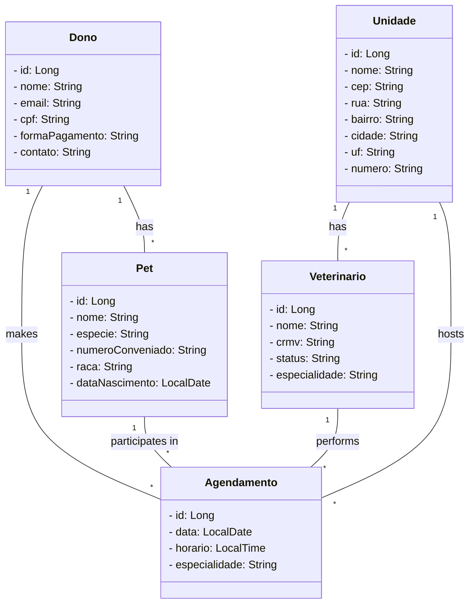

# Projeto de API feito para Clínica veterinária

Projeto de RESTful API em Java realizado como abstração.

O projeto foi realizado para entregar o desafio de projeto final do Bootcamp Santander Back End em Java da plataforma DIO

Este projeto foi idealizado em diferentes formas em algumas vezes em projetos de matérias da faculdade, e por ver a oportunidade de treino, realizei uma API para utilizar no projeto.

Aprendi muito sobre injeção de dependências ao decorrer do projeto, e sobre a inversão de controle do Spring Framework.

